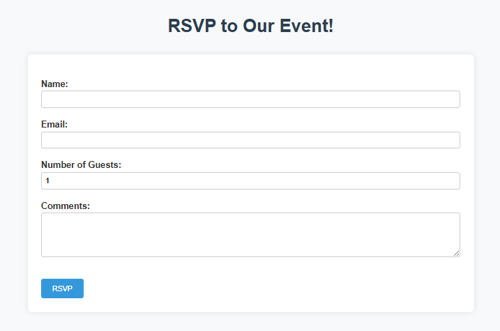
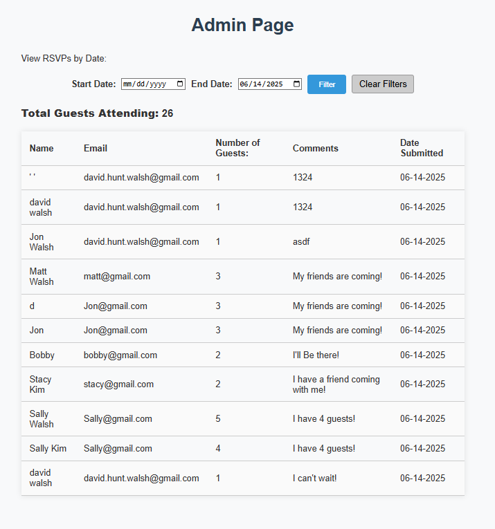
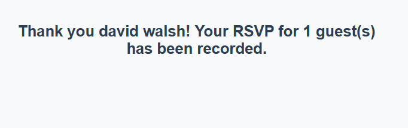
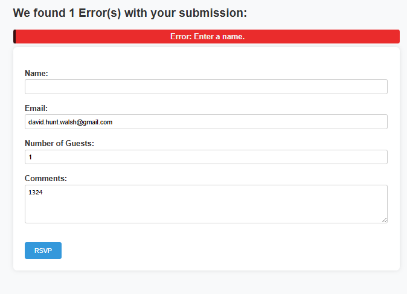

# 🎉 ColdFusion RSVP Web Application

This is a simple RSVP tracking system built using **Adobe ColdFusion** and **Microsoft Access**. It allows users to submit RSVP information through a form, and provides an admin dashboard to review submissions, filter by date, and view total guest counts.

Designed as a beginner-friendly portfolio project to demonstrate:

- ColdFusion form processing
- Server-side validation
- Database interaction (ODBC + Access)
- Admin filtering and reporting
- Basic web styling

---

## 🧠 Features

- ✅ RSVP form with field validation
- ✅ Data storage in Access database
- ✅ Admin dashboard with RSVP list
- ✅ Date range filters (with default values)
- ✅ Total guest count display
- ✅ "Clear Filters" button
- ✅ Basic styling with custom CSS

---

## 🚀 Getting Started

### 1. Clone the Repository

```bash
git clone https://github.com/your-username/rsvp-app.git
```

### 2. Set Up in ColdFusion

Move the project into your ColdFusion web root directory:

- **Adobe ColdFusion**:
  `C:\ColdFusion2023\cfusion\wwwroot\rsvp-app\`

- **Lucee**:
  `C:\lucee\tomcat\webapps\rsvp-app\`

### 3. Create the Datasource

In your **ColdFusion Administrator**:

- Go to: **Data Sources** → **ODBC Socket**
- Name: `RSVPAccessDB`
- Path: Point it to the included `rsvps.accdb` file

### 4. Run the Application

- Open your browser and visit:

  - `http://localhost:8500/rsvp-app/index.cfm` to view the RSVP form
  - `http://localhost:8500/rsvp-app/admin.cfm` to access the admin dashboard

---

## 📸 Screenshots

### RSVP Form

> Screenshot of the user-facing RSVP form.



### Admin Dashboard

> Screenshot of the admin view showing filtered RSVP data and guest totals.



> Screenshot of a successful RSVP.



> Screenshot of an unsuccessful RSVP.

> 
